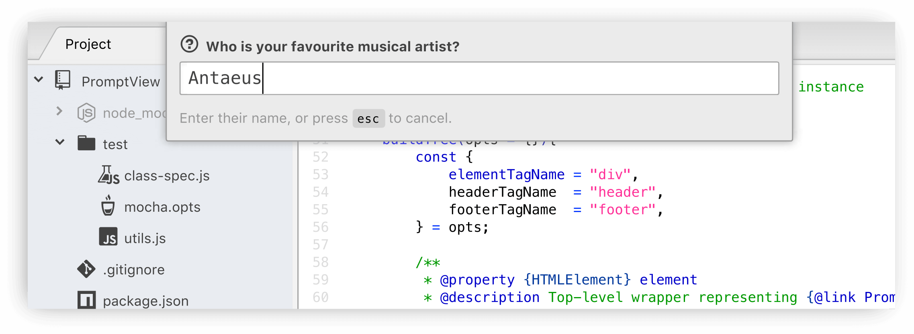

PromptView
==========

Lightweight dialogue component for prompting user input.

Usage
-----
The component was designed to match the look-and-feel of Atom's usual modal dialogues
(such as those used by its [`go-to-line`][] and [`fuzzy-finder`][] packages).

~~~js
const PromptView = require("prompt-view");

let view = new PromptView();
let answer = await view.promptUser({
	headerText: "What's your favourite movie?",
	footerText: "Enter a name or YouTube URL",
});
~~~

The same `PromptView` can be used multiple times, even if messages differ.
Package authors need not create more than one `PromptView` throughout their
package's lifecycle:

~~~js
answer = await view.promptUser({
	headerText: "What's your second favourite movie?",
	footerText: `You answered "${answer}" last time.`,
});
~~~

Properties may be set during construction, or set at the time the user is prompted for input:

~~~js
view = new PromptView({headerHTML: "<b>Enter something:</b>"});
view.promptView().then(reply => …);

// Same as:
view = new PromptView();
view.promptView({headerHTML: "<b>Enter something:</b>"});
~~~

Browsers
--------
Although this component was written with [Atom][] projects in mind, it works in ordinary browser environments too, with the following caveats:

1.	No styling is applied; authors must provide this in their own stylesheets.

2.	The [`hidden`][] attribute is used to control visibility, unless the container
	element is a [`<dialog>`][] element.
	
3.	Newly-created `PromptView` objects are appended to the page's [`<body>`][] node.
	Authors should move this somewhere more suitable if a different location in the
	DOM is required.

TODO
----
* [x] Implement placeholder setting
* [ ] Document class properties
* [ ] Publish to NPM

[Referenced links]:_________________________________________________________________
[Atom]:           https://atom.io/
[`fuzzy-finder`]: https://github.com/atom/fuzzy-finder#readme
[`go-to-line`]:   https://github.com/atom/go-to-line#readme
[`hidden`]:       https://developer.mozilla.org/en-US/docs/Web/HTML/Global_attributes/hidden
[`<dialog>`]:     https://developer.mozilla.org/en-US/docs/Web/HTML/Element/dialog
[`<body>`]:       https://developer.mozilla.org/en-US/docs/Web/HTML/Element/body
